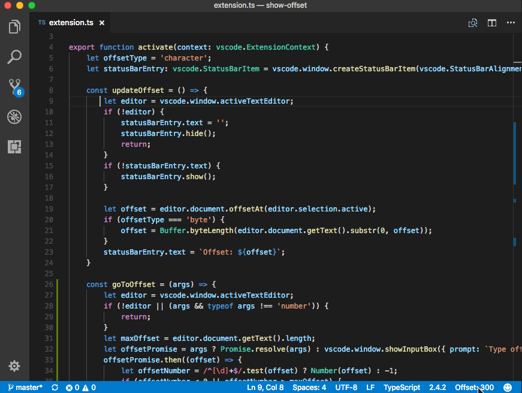

# README

This extension to Visual Studio Code creates a status bar item on the right displaying the offset of the cursor in the document. 

You can set the setting `showoffset.offsetType` to either `character` or `byte`. 

You can also run the command `Showoffset: Got to offet` which will navigate your cursor to given offset.

